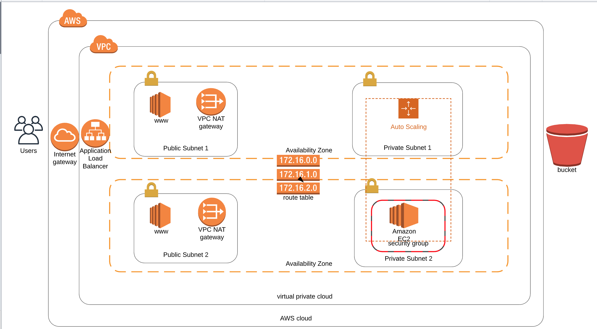

# Deploy a high-availability web app using CloudFormation.

PROJECT URL - http://udagr-WebAp-15K816B6Z0GLQ-401232041.us-west-2.elb.amazonaws.com

## Summary
* [Introduction](#Introduction)
* [Project Description](#Project-Description)
* [Getting Started](#Getting-Started)
* [Application Deployment Diagram](#Application-Deployment-Diagram)
* [Prerequisites](#Prerequisites)
* [Running the tests](#Running-the-tests)
* [Built With](#Built-With)
* [Contributing](#Contributing)
* [Authors](#Authors)
* [License](#License)
* [Acknowledgments](#Acknowledgments)

## Introduction

As the final project for the Lesson 2, I am faced with a real scenario.

Creating this project will give me hands-on experience I need to confidently talk about infrastructure as code. So, for that reason, we have chosen a realistic scenario where I deploy an application (Apache Web Server) and I also pick up code (JavaScript and HTML) from S3 Storage and deploy it in the appropriate folder on the web server.

There will be two parts to this project:

You'll first develop a diagram that you can present as part of your portfolio and as a visual aid to understand the CloudFormation script.
The second part is to interpret the instructions as well as your own diagram and create a matching CloudFormation script.

## Project Description

Your company is creating an Instagram clone called Udagram. Developers pushed the latest version of their code in a zip file located in a public S3 Bucket.

You have been tasked with deploying the application, along with the necessary supporting software into its matching infrastructure.

This needs to be done in an automated fashion so that the infrastructure can be discarded as soon as the testing team finishes their tests and gathers their results.

### Getting Started
#### Run aws cloudformation scripts below

###### From the project root folder run for:

Network Deployment: ./create.sh udagramNetworkInfra ktUdagramNetwork.yml ktUdagramNetwork-params.json

IAM Deployment: ./create.sh iamInfraStack iam.yml ktUdagramServer-params.json

Servers Deployment:  ./create.sh udagramServerInfra ktUdagramServer.yml ktUdagramServer-params.json

Run the script from terminal(Windows, Linux or Mac) with AWS client application installed and configured connect and run cloudformation scripts on AWS.

### Application Deployment Diagram
  
  
### Prerequisites

AWS accout provisioned with, S3 bucket,  and IAM role with admin level access to connect a AWS. 

### Running the tests
Test by using the aws console to verify if the stack were created as expected.

### Built With

* [AWS](https://aws.amazon.com/) - Amazon Web Services.
* [Lucidchart](https://www.lucidchart.com/pages/?noHomepageRedirect=true) - Diagrams done right.

### Author

* **Kazeem Tijani** 

### License

This project is licensed under the MIT License - see the [LICENSE.md](LICENSE.md) file for details

### Acknowledgments

* Inspiration [AWS Documentation](https://docs.aws.amazon.com/redshift/latest/dg/r_CREATE_TABLE_NEW.html),
[PurpleBooth](https://gist.github.com/PurpleBooth/109311bb0361f32d87a2)

